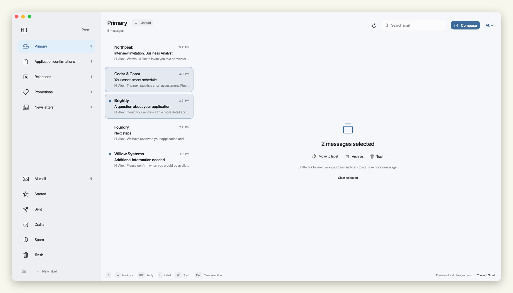
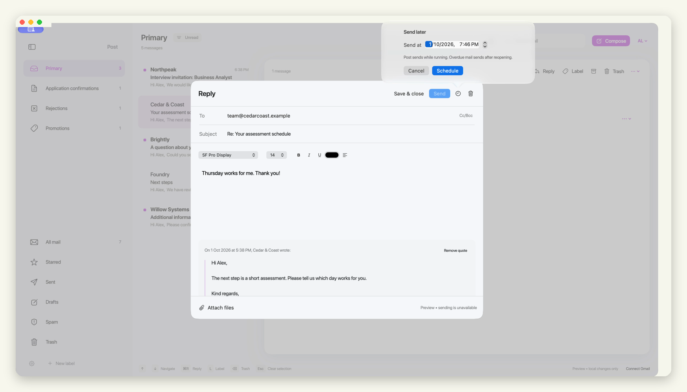
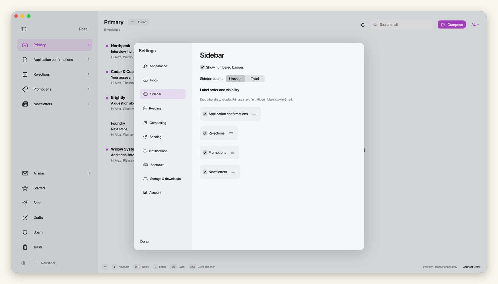
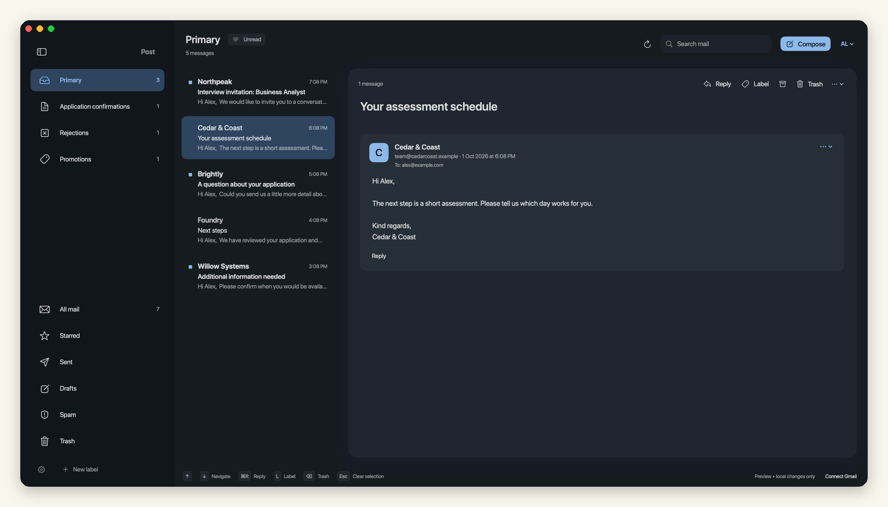

# Post

[](https://github.com/JackCosta2612/Post/releases/tag/v0.2.5) [](https://github.com/JackCosta2612/Post/actions) [](LICENSE)

A native SwiftUI email client for macOS and one Gmail account. Labels, keyboard navigation, and a quiet three-pane layout are the focus.

https://github.com/user-attachments/assets/f331c8a5-f2b5-4768-816f-6a3f7d1f7de0


<table>
<tr><td><br><b>Select and move together</b></td><td><br><b>Write now, send later</b></td></tr>
<tr><td><br><b>Arrange your labels</b></td><td><br><b>Choose your appearance</b></td></tr>
</table>

## Try it

Requires macOS 14 or later. [Download Post](https://github.com/JackCosta2612/Post/releases/latest), extract the app archive and move Post to Applications. Versions 0.2.3 and later support signed in-app updates.

To build from source, install Apple's Command Line Tools or Xcode. The build fetches a verified copy of Sparkle. No paid Apple developer membership is needed for a local build.

```sh
git clone https://github.com/JackCosta2612/Post.git
cd Post
./setup-signing.sh
./build.sh
./install.sh
open /Applications/Post.app
```

The app starts with fictional sample mail until you connect Gmail. Follow the [Gmail setup guide](Setup.md) for your own Google Cloud project and Desktop OAuth client. Each person connects their own account; no shared OAuth credentials are bundled.

See [build and signing instructions](docs/build.md) for prerequisites, Keychain prompts, Xcode, and rebuilding the icon.

## Mail, with room to breathe

| | |
| --- | --- |
| **An inbox you choose** | Decide which labels belong in Primary. Filter any view to unread mail. |
| **Keep moving** | Arrow-key navigation, selection without checkboxes, and custom label shortcuts. |
| **Learns your labels** | Local learning follows your manual moves. Clear matches sort automatically; uncertain mail stays in the inbox. |
| **A place for everything** | Reorder labels, hide the ones you don’t use, and move messages by dragging. |
| **The whole conversation** | Threads open at the selected message. Earlier quotes stay folded away. |
| **Write when it suits you** | Rich text, attachments, saved drafts, Undo Send, and scheduled sending. |
| **Make it yours** | Light and dark themes, accent colors, separate fonts, and adjustable list density. |

Search spans all mail, including Trash and Spam, with an option to search only the current folder. Cached matches appear immediately while Gmail finds more results. Mail is cached for offline reading, with a faster cache option for media and conversations. Notifications can follow selected labels or senders, respect quiet hours, and hide private details. [Explore the settings](docs/settings.md).

## Stay up to date

Open **Post → Check for updates…** to compare your installed version with the latest GitHub release. The same check is available from the account menu and Settings → Account, alongside the installed version and build. Post can download and install signed updates without a package manager. Enable automatic installation in Settings → Account, or check manually. See the [release guide](docs/releases.md) and [changelog](CHANGELOG.md).

## Default keys

| Action | Key |
| --- | --- |
| Next / previous message | Down / Up |
| Extend selection | Shift + Down / Up |
| Reply / reply all | Command + R / Command + Shift + R |
| Compose | Command + N |
| Label / archive / Trash | L / E / Delete |
| Clear selection | Escape |
| Search | Command + F |
| Refresh | Command + Shift + Option + R |
| Toggle sidebar | Command + S |

Typing keeps normal cursor and editing behavior. Escape after editing a reply offers Save, Discard changes, or Keep writing. Return activates a prompt's default action; Escape cancels it.

## Data and limitations

OAuth credentials stay in macOS Keychain. Cached messages, drafts, schedules, and preferences live in `~/Library/Application Support/Post/mail-cache.json`. Faster mode stores downloaded attachment bytes separately in `AttachmentCache`; remote images use `RemoteImages` under the same folder. The cache is local JSON, not a separately encrypted database. Remote attachment bytes are fetched when needed. Attachment clicks download directly to Downloads, with a configurable destination in Settings. HTML runs without sender-provided JavaScript.

Disconnecting removes the sign-in token but keeps cached mail. To remove local mail too, quit Post and remove its Application Support folder. Revoke the authorization in your Google account if you no longer use the app.

Post is an early client under active development. It supports one account at a time. Pagination loads more mail on demand; it does not download your entire account at startup. Notifications and synchronization require the app to be running. Composition supports rich text and formatted quoted messages. There is no AI sorting, encrypted-email support, background daemon, or notarized binary release. The source and native layered icon are included.

## Development

```sh
./test.sh
./build.sh
```

Tests use fictional data and simulated Gmail responses. The [contributing guide](CONTRIBUTING.md) describes bug reports and local testing. MIT licensed.
