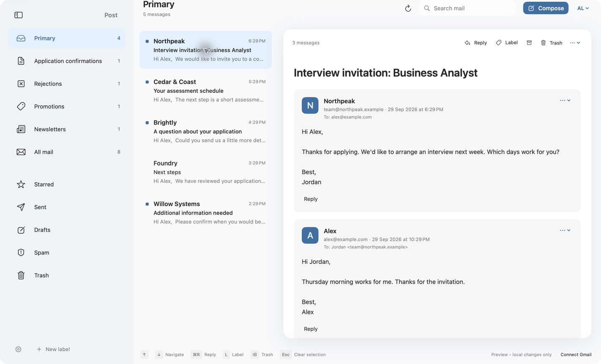
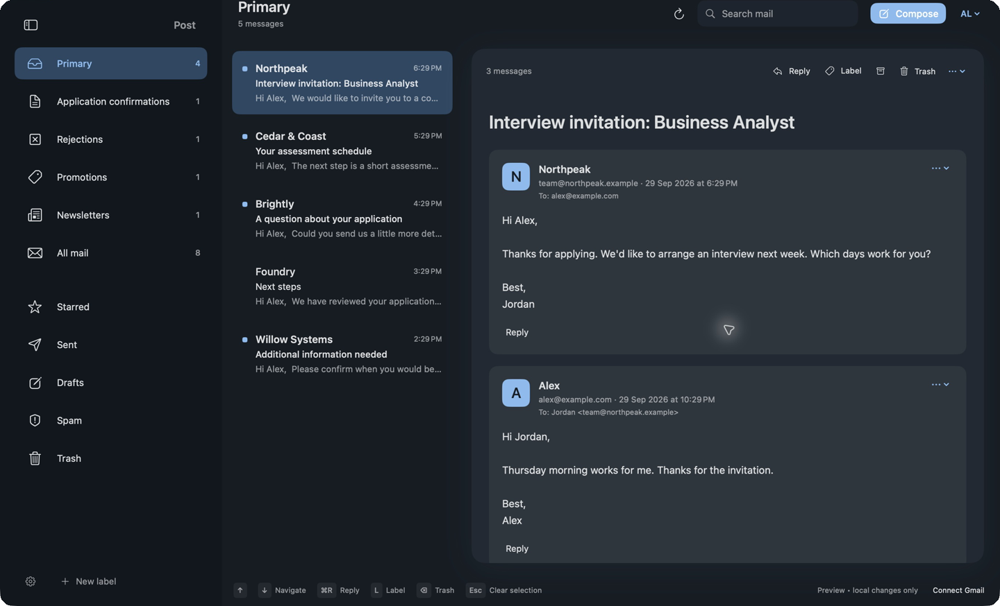

# Post

A native SwiftUI email client for macOS and one Gmail account. Labels, keyboard navigation, and a quiet three-pane layout are the focus.




## Try it

Requires macOS 14 or later and Apple's Command Line Tools or Xcode. There are no package dependencies and no paid Apple developer membership is needed for a local build.

```sh
git clone https://github.com/JackCosta2612/Post.git
cd Post
./setup-signing.sh
./build.sh
open ../Post.app
```

The app starts with fictional sample mail until you connect Gmail. Follow the [Gmail setup guide](Setup.md) for your own Google Cloud project and Desktop OAuth client. Each person connects their own account; no shared OAuth credentials are bundled.

See [build and signing instructions](docs/build.md) for prerequisites, Keychain prompts, Xcode, and rebuilding the icon.

## Features

- Light, Dark, or System appearance. Collapsible sidebar with unread or total counts.
- Primary shows inbox mail except Promotions and a label named Newsletters. Gmail's own Primary category is available in settings.
- Conversations show incoming mail and sent replies in chronological order, with formatted bodies and per-message reply controls.
- Shift-click, Command-click, and Shift-arrow selection. Bulk label, archive, and Trash without checkboxes.
- Compose, reply, reply all, forward, attachments, autosaved drafts, and confirmed draft deletion.
- Search filtering and highlighting in the loaded list, labels, read status, stars, spam, reversible Trash, and Undo for local mail actions.
- Local cache for offline reading. Embedded images resolve locally; external images are blocked by default.
- Background checking every 60 seconds while running. The loading strip appears only for manual refresh.
- Custom shortcuts update menus and on-screen hints.

## Default keys

| Action | Key |
| --- | --- |
| Next / previous message | Down / Up |
| Extend selection | Shift + Down / Up |
| Reply / reply all | Command + R / Command + Shift + R |
| Compose | Command + N |
| Label / archive / Trash | L / E / Delete |
| Clear selection | Escape |
| Search | Command + F |
| Refresh | Command + Shift + Option + R |
| Toggle sidebar | Command + Option + S |

Typing keeps normal cursor and editing behavior. Escape after editing a reply offers Save, Discard changes, or Keep writing. Return activates a prompt's default action; Escape cancels it.

## Data and limitations

OAuth credentials stay in macOS Keychain. Cached messages, attachment bytes already downloaded, drafts, and preferences live in `~/Library/Application Support/Post/mail-cache.json`. The cache is local JSON, not a separately encrypted database. Remote attachment bytes are fetched when needed. Downloading an attachment asks where to save it. HTML runs without sender-provided JavaScript.

Disconnecting removes the sign-in token but keeps cached mail. To remove local mail too, quit Post and remove its Application Support folder. Revoke the authorization in your Google account if you no longer use the app.

Post is an early client under active development. It supports one account at a time. Pagination loads more mail on demand; it does not download your entire account at startup. Notifications and synchronization require the app to be running. Composition is plain text with a formatted quoted message. There is no AI sorting, encrypted-email support, background daemon, or notarized binary release. The source and native layered icon are included.

## Development

```sh
./test.sh
./build.sh
```

Tests use fictional data and simulated Gmail responses. The [contributing guide](CONTRIBUTING.md) describes privacy-safe bug reports and demo builds. MIT licensed.
